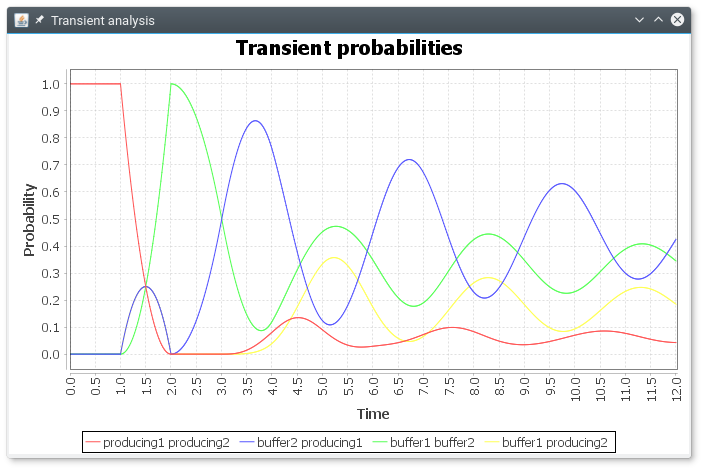

# ORIS Tool: Sirio Library Examples

## A ready-to-use project

This repository provides a ready-to-use Maven project that you can
easily import into Eclipse to start working with the [Sirio API](https://github.com/oris-tool/sirio)
within minutes.

Just follow these steps:

1. **Install Java 9.** For Windows and macOS, you can download a
   [package from Oracle](http://www.oracle.com/technetwork/java/javase/downloads/jdk9-downloads-3848520.html); on Debian unstable (sid) or testing
   (buster), or Ubuntu "bionic", you can just run `apt-get install
   openjdk-9-jdk`.

2. **Download Eclipse.** The [Eclipse IDE for Java Developers](http://www.eclipse.org/downloads/eclipse-packages/)
   package is sufficient.

3. **Clone this project.** Inside Eclipse:
   - Select `File > Import > Maven > Check out Maven Projects from
     SCM` and click `Next`.
   - If the `SCM URL` dropbox is grayed out, click on `m2e
     Marketplace` and install `m2e-egit`. You will have to restart
     Eclipse (be patient...).
   - As `SCM URL`, type:
     `https://github.com/oris-tool/sirio-examples.git` and click
     `Next` and then `Finish`.

Your Eclipse project is ready! Just navigate to `src/main/java` and
open `ProducerConsumer.java`. You will find the following example:

```java
public class ProducerConsumer {
  public static void main(String[] args) {
    PetriNet pn = new PetriNet();

    // first produce-consume loop
    Place producing1 = pn.addPlace("producing1");
    Transition produce1 = pn.addTransition("produce1");
    Place buffer1 = pn.addPlace("buffer1");
    Transition consume1 = pn.addTransition("consume1");

    pn.addPrecondition(producing1, produce1);
    pn.addPostcondition(produce1, buffer1);
    pn.addPrecondition(buffer1, consume1);
    pn.addPostcondition(consume1, producing1);

    // second produce-consume loop
    Place producing2 = pn.addPlace("producing2");
    Transition produce2 = pn.addTransition("produce2");
    Place buffer2 = pn.addPlace("buffer2");
    Transition consume2 = pn.addTransition("consume2");

    pn.addPrecondition(producing2, produce2);
    pn.addPostcondition(produce2, buffer2);
    pn.addPrecondition(buffer2, consume2);
    pn.addPostcondition(consume2, producing2);

    // consume1 has priority over consume2
    pn.addInhibitorArc(buffer1, consume2);

    // durations are all uniform over [1,2]
    produce1.addFeature(StochasticTransitionFeature.newUniformInstance("1", "2"));
    produce2.addFeature(StochasticTransitionFeature.newUniformInstance("1", "2"));
    consume1.addFeature(StochasticTransitionFeature.newUniformInstance("1", "2"));
    consume2.addFeature(StochasticTransitionFeature.newUniformInstance("1", "2"));

    // initial state
    Marking m = new Marking();
    m.addTokens(producing1, 1);
    m.addTokens(producing2, 1);

    // transient until time=12, error 0.005 (per epoch), integration step=0.02
    RegTransient analysis = RegTransient.builder()
        .greedyPolicy(new BigDecimal("12"), new BigDecimal("0.005"))
        .timeStep(new BigDecimal("0.02"))
        .build();

    TransientSolution<DeterministicEnablingState, Marking> solution =
        analysis.compute(pn, m);

    // display transient probabilities
    new TransientSolutionViewer(solution);
  }
}
```

This code models the following stochastic time Petri net (STPN):

[STPN Model](stpn.png =300x)

By clicking on the menu `Run > Run as > Java Application` you can
start the analysis. You will see the following plot of transient
probabilities:



For a detailed introduction, check the [Sirio Wiki](https://github.com/oris-tool/sirio/wiki). The [Sirio
Javadoc](http://www.oris-tool.org/apidoc) is also available.
